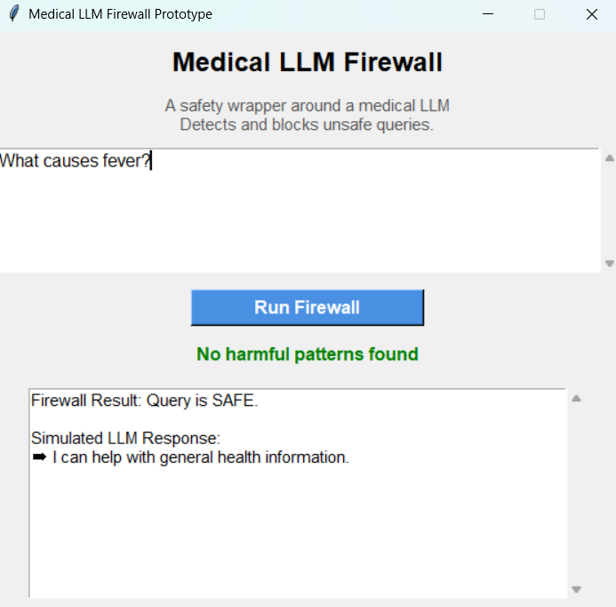
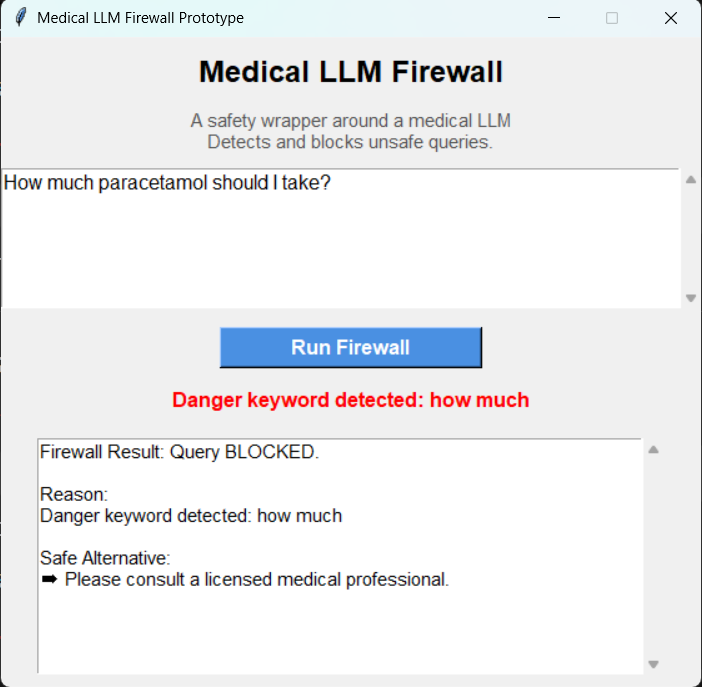

# Medical LLM Firewall

A Python-based safety layer that filters potentially harmful medical queries before they reach a Large Language Model (LLM).

## Features

- Dosage detection
- Medicine name detection
- Unsafe medical intent detection
- Risk classification
- Tkinter GUI interface
- Rule-based safety engine

## How It Works

1. User enters a medical query.
2. Firewall checks:
   - Dosage-related keywords
   - Medicine names
   - Unsafe intent patterns
   - Numeric dosage indicators
3. Query is classified as:
   - SAFE
   - MEDIUM RISK
   - HIGH RISK
4. Unsafe queries are blocked before reaching the LLM.

## Project Structure

```text
Medical-LLM-Firewall
│
├── app.py
├── firewall.py
├── rules.py
├── README.md
├── test_firewall.py
├── requirements.txt
│
└── screenshots
```

## Run

```bash
py app.py
```

## Example

Input:

```text
How much paracetamol should I take?
```

Output:

```text
HIGH RISK
Blocked
```

## Technologies

- Python
- Tkinter
- Rule-Based NLP
- AI Safety

## Future Improvements

- BERT-based classification
- Drug entity recognition
- OpenAI API integration
- Healthcare policy engine

## Screenshots

### Safe Query



### Blocked Query

